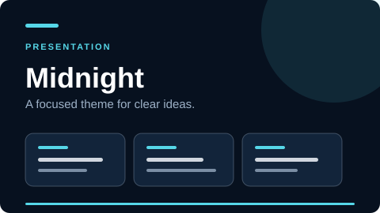
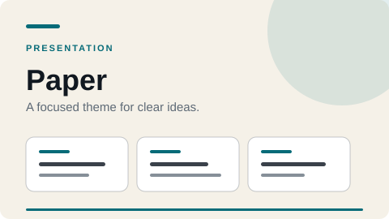
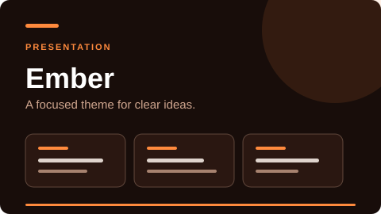
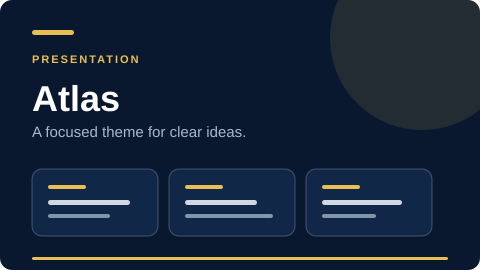
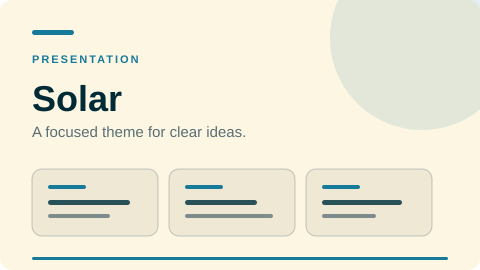
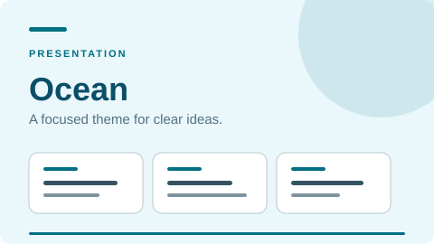
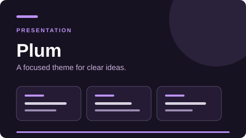
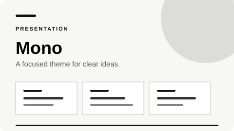
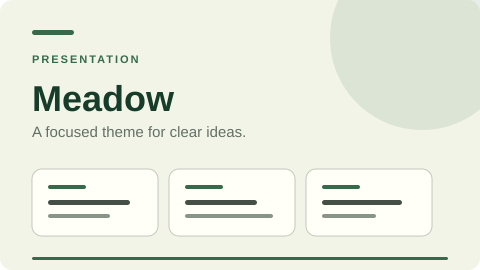

# Presentation Harness

A dependency-free HTML presentation harness with keyboard/touch navigation, print support, configurable localization, and nine presentation-defined themes. Generated decks inline their CSS, configuration, and runtime into one self-contained `index.html` that can be shared or opened directly. Shared Agent Skills make the same workflows available to Pi, OpenCode, Claude Code, and Codex. The harness is tracked; presentation content stays local and is ignored by Git.

## Quick start

First iterate on the audience, narrative, slide outline, and visual direction in chat. Generate files only after the user explicitly approves that proposal.

```bash
npm run new -- architecture-review \
  --title "Architecture Review" \
  --languages en,es \
  --default-language auto \
  --theme midnight

npm run serve
```

The generator creates `content.md` before `index.html` and `deck.config.js`. Replace its starter copy with the approved brief and slide-by-slide content, then implement the HTML from that source artifact. Keep all three files aligned and run `npm run bundle -- architecture-review` after configuration changes.

Open `http://127.0.0.1:4173/presentations/architecture-review/`. The trailing slash is intentional. You can also copy or double-click `presentations/architecture-review/index.html`; it has no local CSS, configuration, or JavaScript dependencies.

## Privacy boundary

Everything inside `presentations/` is ignored except `.gitkeep`:

```gitignore
presentations/*
!presentations/.gitkeep
```

Do not use `git add -f` for presentation files. They may contain internal plans, customer information, or unpublished research.

## Configurable languages

Each deck has a local `deck.config.js`:

```js
window.PRESENTATION_CONFIG = {
  id: "architecture-review",
  fallbackLanguage: "en",
  defaultLanguage: "auto",
  languages: {
    en: { label: "English", direction: "ltr" },
    es: { label: "Español", direction: "ltr" },
    ar: { label: "العربية", direction: "rtl" }
  },
  translations: {
    en: { "slides.title.heading": "Architecture Review" },
    es: { "slides.title.heading": "Revisión de arquitectura" },
    ar: { "slides.title.heading": "مراجعة البنية" }
  },
  theme: "midnight",
  fallbackTheme: "midnight",
  themes: {
    midnight: {
      label: "Midnight",
      colorScheme: "dark",
      variables: {
        "--harness-bg": "#07111f",
        "--harness-panel": "#12243a",
        "--harness-text": "#f2f7fb",
        "--harness-muted": "#9db1c7",
        "--harness-accent": "#56d7e8"
      }
    }
  }
};
```

Language selection precedence:

1. `?lang=<code>` URL parameter
2. Saved user selection
3. Browser languages when `defaultLanguage: "auto"`
4. Configured default
5. Fallback language
6. First configured language

The harness matches regional browser values such as `es-ES` to a configured base language such as `es`.

### Translation attributes

```html
<h1 data-i18n="slides.title.heading">Fallback title</h1>
<button data-i18n-aria-label="controls.next">→</button>
<div data-i18n-html="slides.diagram.markup"></div>
```

`data-i18n-html` is intended only for trusted, repository-local translation content.

## Presentation-defined theme

Deck authors define themes in `deck.config.js` with semantic CSS custom properties and select one with `theme`. The choice is part of the presentation definition, not a viewer preference; there is no runtime theme selector, URL override, or stored theme choice.

Theme resolution is deterministic:

1. Configured `theme`
2. Configured `fallbackTheme`
3. First configured theme

The generator offers nine original presets. They are informed by recurring families in widely used presentation systems rather than copied from them: Reveal.js ships dark, light, beige/serif, solarized, sky, and vivid dark themes; Marp describes its Uncover theme as simple, minimal, and modern. The result is a practical spread across minimal, professional, editorial, high-impact, and organic styles.

Sources: [Reveal.js themes](https://revealjs.com/themes/), [Marp built-in themes](https://github.com/marp-team/marp-core/blob/main/themes/README.md), and [SlidesCarnival's popular templates](https://www.slidescarnival.com/category/free-templates/popular-templates). These sources show common theme families, not an objective popularity ranking.

### Theme gallery

| Theme | Preview | Designed for |
| --- | --- | --- |
| `midnight` |  | Technical talks, product launches, data-heavy stories |
| `paper` |  | Editorial narratives, reports, thoughtful long-form decks |
| `ember` |  | Bold keynotes, launches, energetic pitches |
| `atlas` |  | Executive reviews, strategy, premium proposals |
| `solar` |  | Workshops, documentation, warm technical decks |
| `ocean` |  | Education, healthcare, calm explanatory stories |
| `plum` |  | Creative technology, demos, modern night-mode decks |
| `mono` |  | Minimal portfolios, architecture, sharp product narratives |
| `meadow` |  | Sustainability, people, lifestyle, organic brands |

Create a deck with a preset:

```bash
npm run new -- quarterly-strategy --theme atlas
```

A generated deck embeds only its selected preset. You can then customize the semantic tokens in its local `deck.config.js`. After changing that definition, run `npm run bundle -- <slug>` to refresh the inline configuration in `index.html`. To rebuild the tracked gallery after changing the preset library, run `npm run themes:previews`.

## Commands

```bash
npm run new -- <slug> [options]  # Generate an ignored local deck
npm run bundle -- <slug>         # Refresh inline CSS, config, and runtime
npm run serve                    # Serve harness and local decks on port 4173
npm run open -- <presentation>   # Start the server and open a deck
npm run themes:previews          # Regenerate the README theme demos
npm run validate                 # Validate templates and local decks
npm test                         # Run the test suite
```

Generator options:

- `--title "Title"`
- `--languages en,es,fr`
- `--default-language auto|<code>`
- `--theme midnight|paper|ember|atlas|solar|ocean|plum|mono|meadow`
- `--force` to replace an existing generated deck

## Repository structure

```text
src/                         Reusable browser harness
scripts/                     Generator, server, and validation
.agents/skills/              Canonical Agent Skills workflows
.claude/skills -> …           Claude Code discovery alias
.opencode/skills -> …         OpenCode discovery alias
templates/                   Tracked content and HTML templates
presentations/               Local ignored content.md and deck files
test/                        Harness tests
```

## Multi-agent skills

The repository separates work into five shared Agent Skills:

- `scaffold-presentation` — get content approval, create `content.md`, then generate a new ignored deck
- `open-presentation` — start the server and launch a local deck
- `localize-presentation` — configure languages and translation keys
- `theme-presentation` — define and check the fixed presentation theme
- `validate-presentation` — test rendering, localization, themes, and privacy boundaries

The canonical skills live in `.agents/skills/`:

- **Pi** discovers `.agents/skills/` and the `pi.skills` package manifest.
- **Codex** discovers `.agents/skills/` directly.
- **OpenCode** discovers `.agents/skills/`; `.opencode/skills` is also provided as an alias.
- **Claude Code** uses the `.claude/skills` alias and reads `CLAUDE.md`, which points to the shared `AGENTS.md` instructions.

All agents use the same files, so workflows cannot drift between agent-specific copies.

To open a deck without launching a desktop browser, use `npm run open -- <presentation> --no-browser`. If only one deck exists, `<presentation>` may be omitted.

## Keyboard controls

- `←` / `PageUp`: previous slide
- `→` / `PageDown` / `Space`: next slide
- Click the right 75% of a slide: next slide; click the left 25%: previous slide
- `Home` / `End`: first or last slide
- `F`: fullscreen
- `P`: print

## License

MIT
